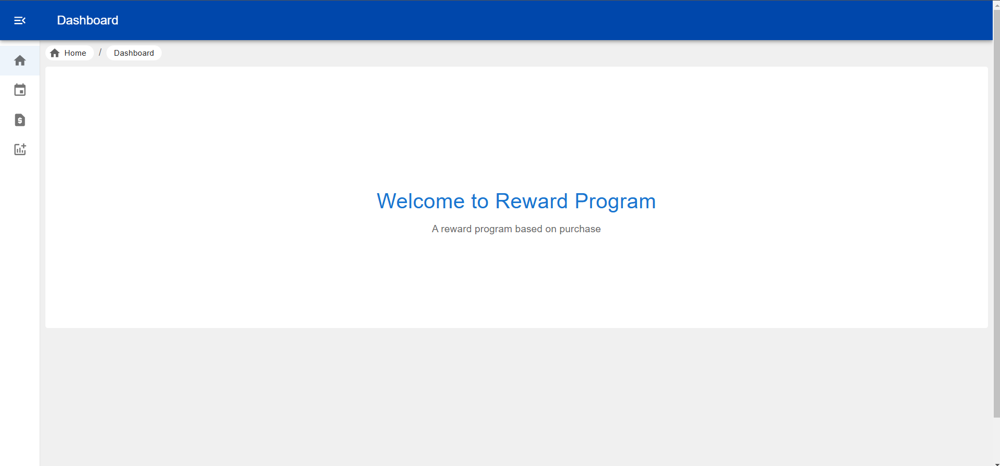
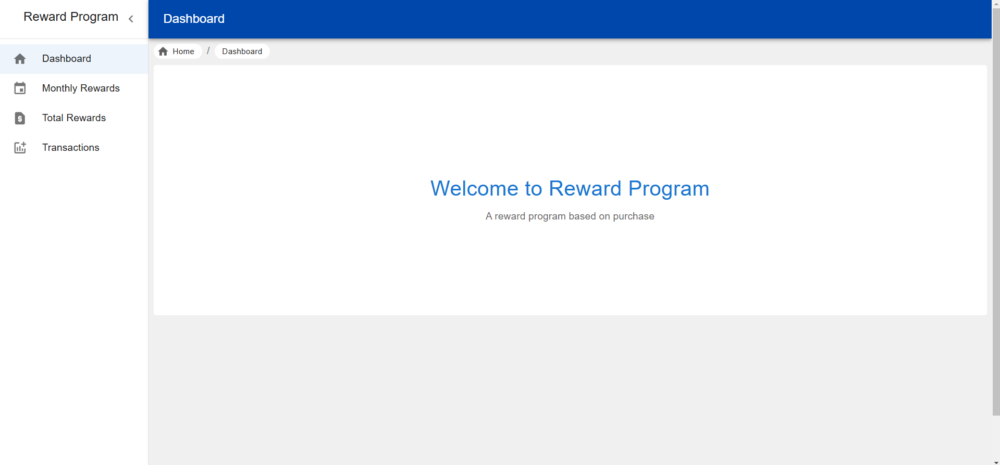
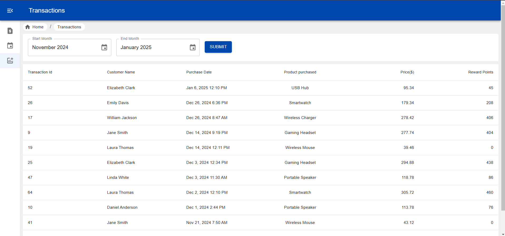
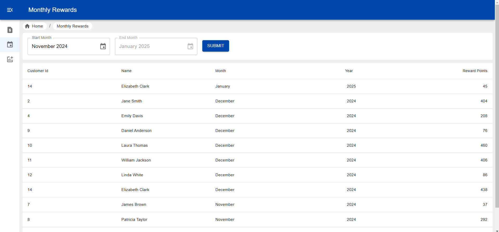
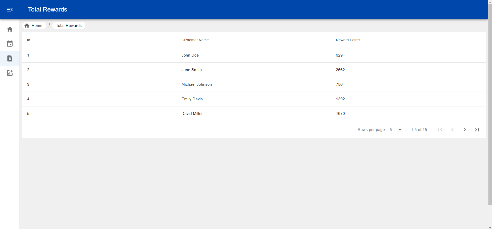
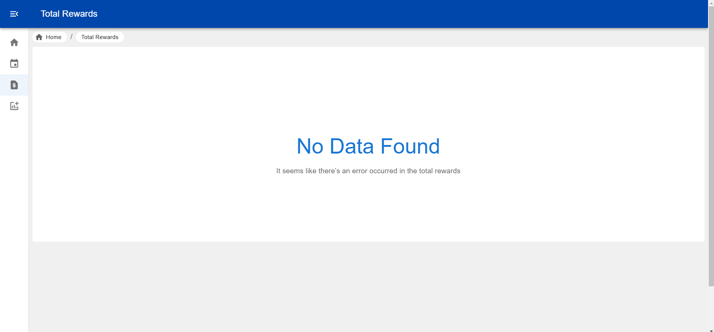
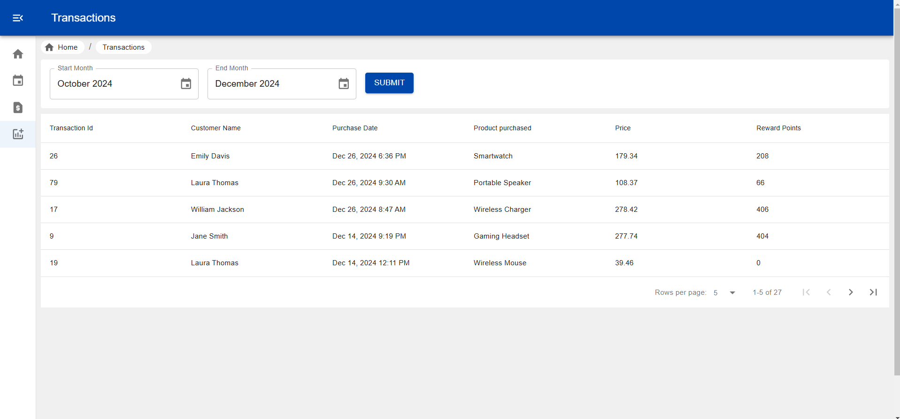
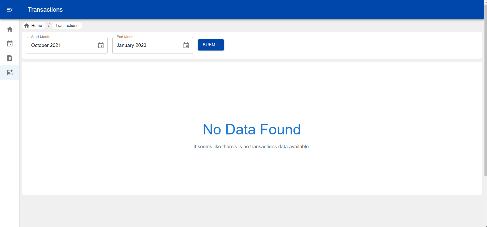

# Reward Program

A retailer offers a rewards program to its customers, awarding points based on each recorded purchase.

A customer receives 2 points for every dollar spent over $100 in each transaction, plus 1 point for every dollar spent between $50 and $100 in each transaction.

(e.g. a 120 purchase = 2x20 + 1x$50 = 90 points).

## Project Approach

This section outlines the approach taken to build this Reward Program application. The steps below follow a structured and organized process for creating a maintainable and scalable app.

### 1. **Initial Planning and Requirements**

- **Goal Definition**: The primary objective was to build a React application with reusable components, dynamic data handling, and integration with external APIs created by.
- **Feature Identification**: Core features like UI components, API utilities, dummy datasets, dynamic data rendering, and automated testing were prioritized.
- **Technology Stack**:
  - React.js for the frontend
  - Webpack for bundling
  - Babel for transpiling
  - Jest for testing
  - ESLint for code quality and consistency

### 2. **Project Setup and Structure**

- The project was initialized using `npm init` for ease of setup and configuration.
- A custom folder structure was created to ensure scalability:
  - `src/` for all source code, including components, pages, API utilities, and helper functions.
  - Configuration files for Webpack, Babel, ESLint, and Jest were created for optimized development and production environments.

### 3. **UI/UX Design**

- **Component-Based Development**: The application was built using reusable React components. Each component was isolated and tested to ensure modularity.
- **Responsive Design**: The UI was designed to be mobile-first and responsive, ensuring it works well across various devices.
- **Page Layout**: Different pages were developed with clear structure and navigation, utilizing React Router for page routing.

### 4. **API Integration and Data Handling**

- **API Utility**: All API calls were centralized in the `apis/` folder, where each function is responsible for interacting with the backend. Mock data was used during development.
- **State Management**: React's state management (`useState`, `useEffect`) was used to manage dynamic data. A simple global state was used for shared data between components when necessary.

### 5. **Testing**

- **Unit Testing**: Jest was used for writing unit tests for components and utility functions. Snapshot testing was also implemented to ensure UI consistency.
- **End-to-End Testing**: Integration tests were written to simulate user interactions and ensure the app behaves as expected.
- **Test Coverage**: The code was thoroughly tested for edge cases and scenarios using mock data and APIs.

### 6. **Code Quality and Linting**

- **ESLint Setup**: ESLint was configured to ensure consistent and error-free code across the project.
- **Prettier**: Prettier was used to automatically format code to maintain a clean and readable codebase.

### 7. **Build and Optimization**

- **Webpack Configuration**: Webpack was configured to bundle JavaScript, CSS, and assets efficiently. Code splitting and lazy loading were implemented to reduce the initial bundle size.
- **Image Optimization**: Images and assets were optimized to ensure fast loading times.
- **Production Build**: The app was optimized for production by using Webpack’s minification and other performance optimization techniques.

## Project Setup Guide

This README will guide you through the setup process for this project.

## 1. Install Node.js and npm, Check Versions

### Install Node.js and npm

- **Windows/Mac/Linux**: Download the latest version of Node.js from the official website: [https://nodejs.org](https://nodejs.org).
- Install the downloaded package. Node.js includes npm, the Node package manager.

### Verify Installation and Check Versions

Once installed, verify that Node.js and npm are installed by running the following commands:

```bash
node -v
npm -v
```

This should display the installed versions of Node.js and npm.

## 2. Project structure

```bash
reward-program/
├── dist/                      # Compiled and bundled output (e.g., Webpack build files)
├── node_modules/              # Installed npm packages
├── public/                    # Public assets (e.g., images, datasets)
│   ├── assets/                # All static assets like styles or images
│   └── dataSets/              # Dummy JSON datasets for development/testing
├── src/                       # Source code files for the application
│   ├── apis/                  # API requests and utilities
│   │   └── index.js           # List all API requests
│   ├── components/            # Reusable UI components
│   ├── pages/                 # Different page components of the app
│   ├── utils/                 # Utility functions and helpers
│   ├── app.js                 # Main app component
│   ├── index.html             # Index page components
│   └── index.js               # Entry point to the application
├── .babelrc                   # Babel configuration for transpiling code
├── .gitattributes             # Git configuration (to manage line endings, etc.)
├── .gitignore                 # Files/folders to be ignored by git
├── .eslintrc.js               # ESLint configuration for code linting
├── jest.config.js             # Jest configuration for testing
├── jest.setup.js              # Jest setup file
├── package.json               # Project metadata and dependencies
├── package-lock.json          # Locked versions of dependencies
├── README.md                  # Project documentation
└── webpack.config.js          # Webpack configuration file for bundling

```

## 3. Start `npx json-server` from the Main Directory

To start the `json-server` in the main project directory:

1. Install `json-server` globally

   ```bash
   npm -g install json-server
   ```

2. Navigate to the project’s root directory:

   ```bash
   cd /path/to/your/reward-program
   ```

3. Run the `json-server` with:

   ```bash
   npx json-server --watch public/dataSets/dataSets.json --port 5000
   ```

   This will start a mock API server, watching the `db.json` file on port 5000. You can now interact with the mock API through this server.

## 4. Clone Git Repository

To clone the Git repository to your local machine, follow these steps:

1.  Open a terminal and run:

    ```bash
    git clone https://github.com/iamdaskaustav/reward-program.git
    ```

2.  Change into the project directory:
    ```bash
    cd reward-program
    ```

## 5. Setup React Project from Cloned Git Repository

Once you've cloned the repository, set up the React project by installing the dependencies:

1.  In the project directory, run:

    ```bash
    npm install
    ```

    This will install all the necessary dependencies listed in the `package.json` file.

2.  After installation is complete, you can start the development server with:

    ```bash
    npm run start
    ```

    This will open your React app in the browser (usually at `http://localhost:3000`).

## 6. Lint the Project Using `npm run lint`

To lint the project and ensure that the code adheres to the specified coding standards:

1.  In the project directory, run:

    ```bash
    npm run lint
    ```

    This will check for linting issues in the code and display them in the terminal.

## 7. Test the Project Using `npm run test`

To test the project and ensure that the functionality meets the requirements:

1. In the project directory, run:

   ```bash
   npm run test
   ```

   This will execute all the test cases defined using Jest and display the results in the terminal.

2. If you want to watch test files for changes and re-run tests automatically, use:

   ```bash
   npm run test:watch
   ```

3. To generate a test coverage report, use:

   ```bash
   npm run test -- --coverage
   ```

   This will display coverage statistics for your tests, including how much of your code is covered by the tests.

## 8. Build the Project Using `npm run build` in the `dist` Folder

To build the project for production:

1.  In the project directory, run:

    ```bash
    npm run build
    ```

    This will create an optimized production build in the `dist` folder. The build files are ready to be deployed to a production server.

---

## Project Screenshot

1. Dashboard without sidebar open



2. Dashboard sidebar open



3. Page initial loading or after date change submit loading



4. Monthly Reward page with data



5. Monthly Reward page with error message


6. Total Reward page with data



7. Total Reward page with error message



8. Transaction page with data



9. Transaction page with no data message



10. Transaction page with error message


